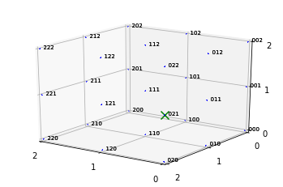
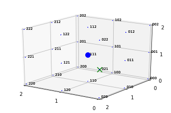
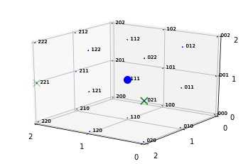
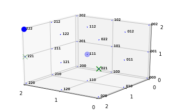
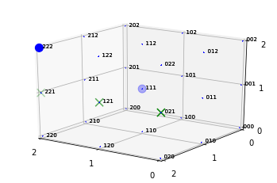
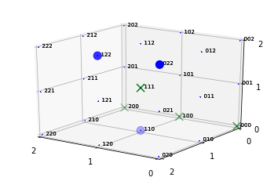

# Tic Tac Toe Game in OpenAI Gym
The 3D version of Tic Tac Toe is implemented as an OpenAI's Gym environment. The [`learning`](./learning) folder includes several Jupyter notebooks for deep neural network models used to implement a computer-based player.

## Complexity
The traditional (2D) Tic Tac Toe has a very small game space (9^3). In comparison, the 3D version in this repo has a much larger space which is in the order of 81^3. This makes computer-based players using search and pruning techniques of the game space prohibitively expensive.

Rather, the current learning models are based on policy gradient and deep Q-learning. The [DQN model](learning/TicTacToe-RL-DQN-TF-v2.ipynb) has produced very promising results. Feel free to experience on your own and contribute if interested. The [PG-based model](learning/TicTacToe-RL-PG-TF.ipynb) needs more work :)

## Contributions
The repo is also open for pull requests and collaborations both in game development as well as learning.

## Dependencies
- Base dependency: `gym`.
- Plot-rendering dependencies: `numpy`, `matplotlib`.
- DQN learning dependencies: `tensorflow`, `numpy`.

## Installation
To install run:
```console
# In your virtual environment
pip install gym-tictactoe
```

## Usage
Currently 2 types of environments with different rendering modes are supported.

### Textual rendering
To use textual rendering create environment as `tictactoe-v0` like so:
```python
import gym
import gym_tictactoe

def play_game(actions, step_fn=input):
  env = gym.make('tictactoe-v0')
  env.reset()
  
  # Play actions in action profile
  for action in actions:
    print(env.step(action))
    env.render()
    if step_fn:
      step_fn()
  return env

actions = ['1021', '2111', '1221', '2222', '1121']
_ = play_game(actions, None)
```
The output produced is:

```
Step 1:
- - -    - - -    - - -    
- - x    - - -    - - -    
- - -    - - -    - - -    

Step 2:
- - -    - - -    - - -    
- - x    - o -    - - -    
- - -    - - -    - - -    

Step 3:
- - -    - - -    - - -    
- - x    - o -    - - x    
- - -    - - -    - - -    

Step 4:
- - -    - - -    - - -    
- - x    - o -    - - x    
- - -    - - -    - - o    

Step 5:
- - -    - - -    - - -    
- - X    - o X    - - X    
- - -    - - -    - - o   
```
The winning sequence after gameplay: `(0,2,1), (1,2,1), (2,2,1)`.

### Plotted rendering
To use textual rendering create environment as `tictactoe-plt-v0` like so:
```python
import gym
import gym_tictactoe

def play_game(actions, step_fn=input):
  env = gym.make('tictactoe-plt-v0')
  env.reset()
  
  # Play actions in action profile
  for action in actions:
    print(env.step(action))
    env.render()
    if step_fn:
      step_fn()
  return env

actions = ['1021', '2111', '1221', '2222', '1121']
_ = play_game(actions, None)
```
This produces the following gameplay:

Step 1:
<p style='text-align:center' >
  </img>
</p>
Step 2:
<p style='text-align:center' >
  </img>
</p>
Step 3:
<p style='text-align:center' >
  </img>
</p>
Step 4:
<p style='text-align:center' >
  </img>
</p>
Step 5:
<p style='text-align:center' >
  </img>
</p>


## DQN Learning
The current models are under [`learning`](./learning) folder. See [Jupyter notebook](./learning/TicTacToe-RL-DQN-TF-v2-eval.ipynb) for a DQN learning with a 2-layer neural network and using actor-critic technique.

Sample game plays produced by the trained model (the winning sequence is `(0,0,0), (1,0,0), (2,0,0)`):
<p style='text-align:center' >
  </img>
</p>
